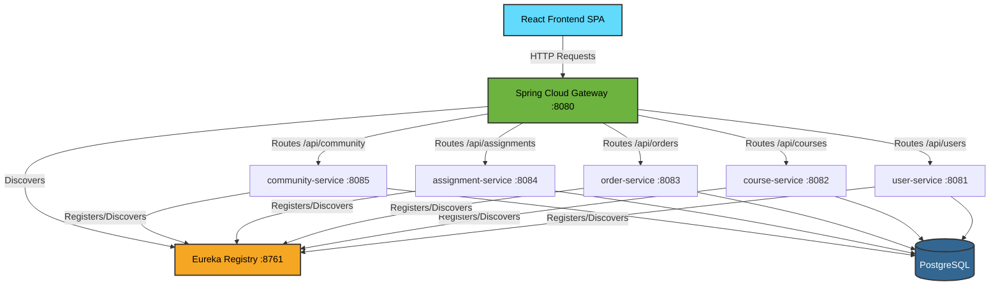
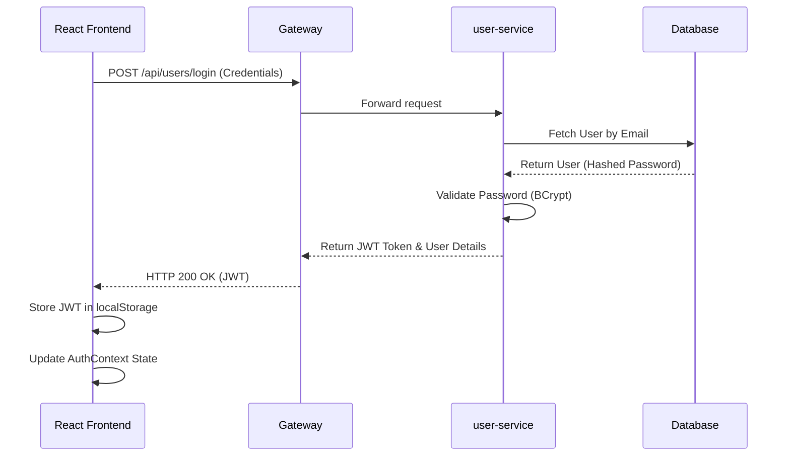
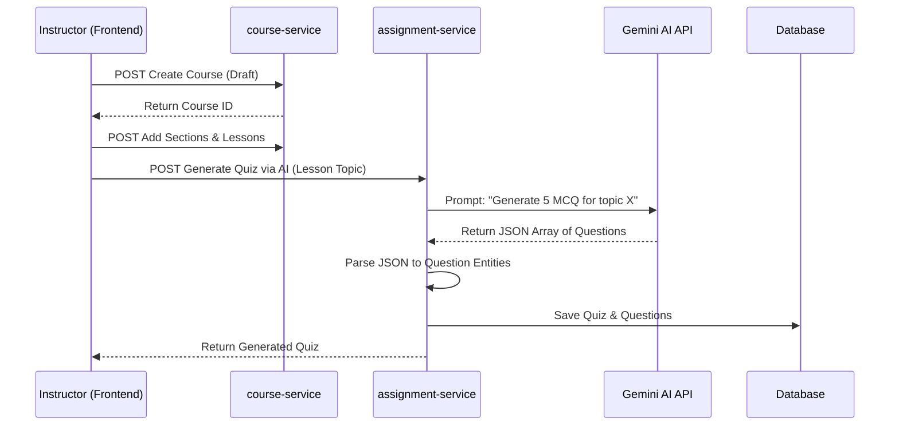

# SkillStore Architecture & Workflow Understanding

Welcome to the **SkillStore** project! This document serves as the comprehensive guide for developers joining the team. It deeply explains how the platform functions end-to-end, the architectural decisions, and the intricate workflows between services. 

SkillStore utilizes a **Microservices Architecture** powered by Spring Boot in the backend and a modern React SPA (Single Page Application) in the frontend.

---

## 1. High-Level Architecture Overview

At its core, the platform is divided into a client-facing React application and a robust backend cluster of Java Spring Boot microservices. All components are containerized using Docker and orchestrated via Docker Compose for local development.



---

## 2. Microservices Breakdown

Each microservice is designed to handle a specific bounded context within the platform.

1. **`registry` (Netflix Eureka Server - Port 8761)**
   - **Role:** Service Discovery mechanism.
   - **How it works:** Every Spring Boot service has a Eureka Client dependency. On startup, they register their location (hostname and port) with this registry. This prevents the need for hardcoded IPs; services can find each other simply by name (e.g., `http://course-service`).

2. **`gateway` (Spring Cloud Gateway - Port 8080)**
   - **Role:** The API Gateway and single point of entry for the frontend.
   - **How it works:** It receives all incoming traffic from the frontend and uses routing rules (predicates) to forward requests to the appropriate backend service. It also handles **Global CORS configuration**.

3. **`user-service` (Port 8081)**
   - **Role:** Identity Provider and Profile Management.
   - **Responsibilities:** Registration, Login, JWT Token generation, validating credentials against hashed passwords, and managing user profiles/roles (`STUDENT`, `INSTRUCTOR`, `ADMIN`).

4. **`course-service` (Port 8082)**
   - **Role:** The Core Catalog.
   - **Responsibilities:** Managing `Course`, `Section`, and `Lesson` entities. Handles the hierarchical structure of a course (e.g., Course -> Sections -> Lessons).

5. **`assignment-service` (Port 8084)**
   - **Role:** Interactive Evaluation Engine.
   - **Responsibilities:** Manages Quiz generation, Assignment creation, questions, and grading logic. **Crucially, it integrates with Google's Gemini AI to auto-generate quizzes.**

6. **`community-service` (Port 8085)**
   - **Role:** Social & Notification Hub.
   - **Responsibilities:** Handles Q&A discussions within lessons, threaded comments, system-wide notifications, and internal alerting mechanisms.

7. **`order-service` (Port 8083)**
   - **Role:** Commerce & Progress Tracking.
   - **Responsibilities:** Manages student enrollments, order processing (mocked payments), and tracking lesson/course completion percentages.

---

## 3. Database Architecture & Data Seeding

We enforce strict data isolation. Even though we run a single physical PostgreSQL container (`skillstore-postgres`), we maintain **logical separation** by creating distinct databases for each service.

- **Databases:** `miniproject_user`, `miniproject_course`, `miniproject_order`, `miniproject_assignment`, `miniproject_community`.
- **Initialization:** An initialization script (`init-multiple-dbs.sql`) runs the first time the Postgres container starts, automating the creation of these schemas.
- **ORM:** We use Hibernate (`spring.jpa.hibernate.ddl-auto=update`) to automatically sync our Java `@Entity` models with database tables.
- **Data Seeding:** Services include `DataSeeder` components (e.g., `AssignmentDataSeeder.java`). These run on `CommandLineRunner` during startup. They check if tables are empty; if so, they populate mock data (Admin users, dummy courses, sample quizzes) so you can test immediately after building.

---

## 4. Deep Dive: Core Workflows

### 4.1. User Authentication & Authorization Flow

SkillStore uses a stateless, token-based authentication system relying on **JWT (JSON Web Tokens)**.



**Subsequent Requests:** The React frontend uses an **Axios Interceptor** to automatically attach the `Authorization: Bearer <token>` header to every outbound request.

---

### 4.2. Course Creation & AI Quiz Generation Flow

Instructors can build courses and leverage AI to instantly generate assessments.



The AI Prompt logic is housed entirely in the `assignment-service`, utilizing the `GEMINI_API_KEY` environment variable.

---

### 4.3. Anti-Cheat Quiz Player & Grading Flow

To prevent students from inspecting network requests to find answers, the backend employs a specific filtering mechanism.

1. **Fetching the Quiz:** When the student opens a quiz, the frontend calls `GET /api/assignments/quizzes/{id}/questions`.
2. **Data Sanitization:** The `assignment-service` intercepts this request, queries the DB, but **strips out the `correctAnswer` field** from every question object before returning the JSON payload.
3. **Submission:** The student submits the quiz. The frontend sends a map of `{ questionId: selectedOption }`.
4. **Server-Side Grading:** The `assignment-service` compares the student's payload against the actual `correctAnswer` in the database, calculates the final score, determines pass/fail based on a threshold, saves the `Attempt` entity, and returns the final grade.

---

### 4.4. Internal Inter-Service Communication

Services often need to notify one another. We achieve this synchronously using HTTP clients (like `RestTemplate` or `OpenFeign`).

**Example Scenario:** A student successfully passes a quiz, and the system needs to post an automated congratulatory message in the community discussion.
1. `assignment-service` finishes grading the attempt.
2. `assignment-service` makes an internal HTTP POST to `http://community-service:8085/api/community/internal/notification`.
3. `community-service` saves the notification entity for the student.

*Note: Since they are in the same Docker network, they use container names as hosts (e.g., `community-service` instead of `localhost`).*

---

## 5. Frontend Architecture Details

The frontend is a React application optimized with Vite.

- **Routing:** Handled by `react-router-dom`. Routes are protected by a higher-order component (or wrapper) that checks for the presence of a JWT and validating the user's role.
- **State Management:** We rely heavily on React Context API (`AuthContext`) for global state (like the logged-in user profile) and local component state for localized logic.
- **Styling:** We use **Tailwind CSS**. It allows for rapid UI development without writing custom CSS files. Complex components use Lucide React for consistent iconography.
- **Network Layer:** A custom Axios instance (`api.js`) is configured with a `baseURL` pointing to the API Gateway (`http://localhost:8080`). Interceptors automatically inject the JWT and handle 401 Unauthorized errors by clearing local storage and redirecting to the login page.

---

## 6. Local Development & Debugging

Setting up the project locally is straightforward thanks to containerization.

### Environment Variables
You must create a `.env` file at the root of the project. This is critical for secrets that should not be committed to Git.
```env
GEMINI_API_KEY=your_actual_google_api_key
POSTGRES_USER=postgres
POSTGRES_PASSWORD=postgres
```

### Docker Commands
- **Booting the stack:** `docker compose up -d --build` (The `-d` runs it in detached mode).
- **Stopping the stack:** `docker compose down` (Use `-v` to wipe the database volumes if you want a fresh start).
- **Viewing Logs:** If a service throws a 500 error, you need the stack trace. Run:
  `docker compose logs -f <service-name>` (e.g., `docker compose logs -f user-service`).

### Hot Reloading
- **Frontend:** Changes to `.jsx` or `.css` files will instantly reflect in the browser on port `3000`.
- **Backend:** Java requires recompilation. If you change code in the `course-service`, you must rebuild that specific container:
  `docker compose up -d --build course-service`

---

## 7. Security & Access Control (RBAC)

Security is enforced at multiple layers:

1. **UI Layer (Frontend):** 
   - `STUDENT` sees the Course Catalog and Course Player.
   - `INSTRUCTOR` sees the Instructor Studio to create courses.
   - `ADMIN` sees the Admin Dashboard to manage users.
2. **API Gateway Layer:** Future implementations may validate the JWT signature at the gateway level before even routing the request to downstream services.
3. **Service Layer (Backend):** Services extract the user's ID/Role from the HTTP headers (or decode the JWT themselves) to ensure, for example, that only an `INSTRUCTOR` can hit the `POST /courses` endpoint.

---
*If you have specific API design questions, refer to the individual controllers within each service. For UI workflows, trace the routes starting from `App.jsx` in the frontend directory.*
